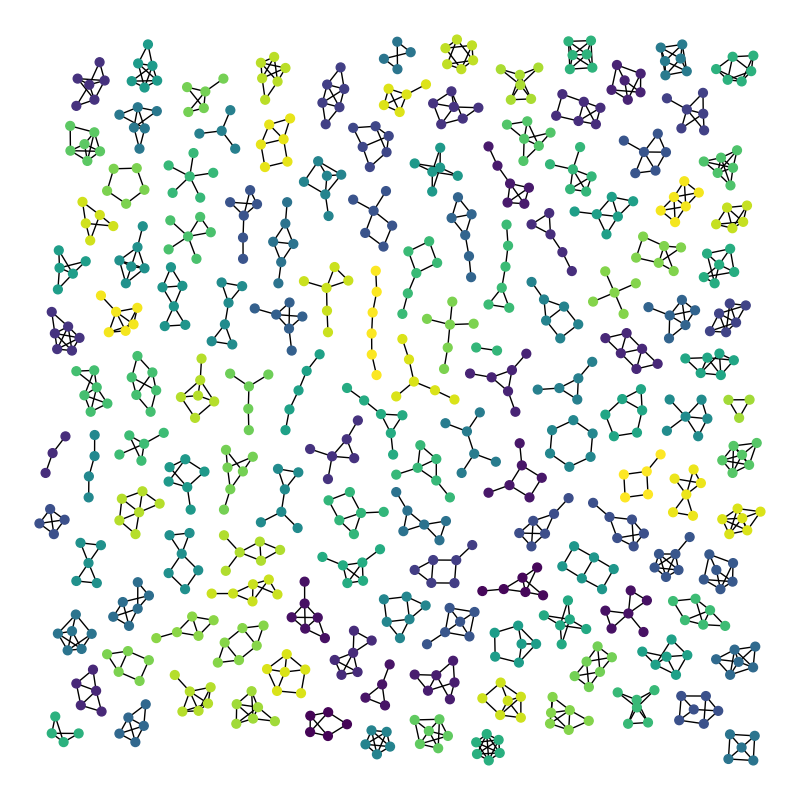

# Awesome Graph Classification

⠀⠀

A collection of graph classification methods, covering embedding, deep learning, graph kernel and factorization papers with reference implementations.

Relevant graph classification benchmark datasets are available [[here]](https://github.com/shiruipan/graph_datasets).

Similar collections about [community detection](https://github.com/benedekrozemberczki/awesome-community-detection), [classification/regression tree](https://github.com/benedekrozemberczki/awesome-decision-tree-papers), [fraud detection](https://github.com/benedekrozemberczki/awesome-fraud-detection-papers), [Monte Carlo tree search](https://github.com/benedekrozemberczki/awesome-monte-carlo-tree-search-papers), and [gradient boosting](https://github.com/benedekrozemberczki/awesome-gradient-boosting-papers) papers with implementations.

  

--------------------------------------------------------------------------------

## Contents  

1. [Matrix Factorization](https://github.com/benedekrozemberczki/awesome-graph-classification/blob/master/chapters/matrix_factorization.md)  
2. [Spectral and Statistical Fingerprints](https://github.com/benedekrozemberczki/awesome-graph-classification/blob/master/chapters/fingerprints.md)
3. [Deep Learning](https://github.com/benedekrozemberczki/awesome-graph-classification/blob/master/chapters/deep_learning.md)  
4. [Graph Kernels](https://github.com/benedekrozemberczki/awesome-graph-classification/blob/master/chapters/kernels.md)

--------------------------------------------------------------------------------

**License**

- [CC0 Universal](https://github.com/benedekrozemberczki/awesome-graph-classification/blob/master/LICENSE)
